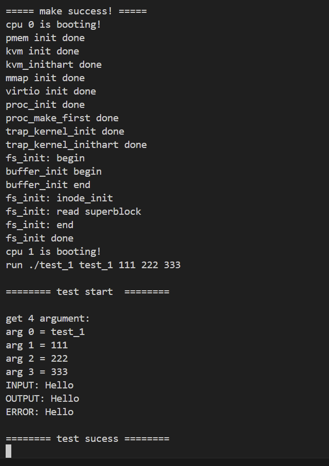
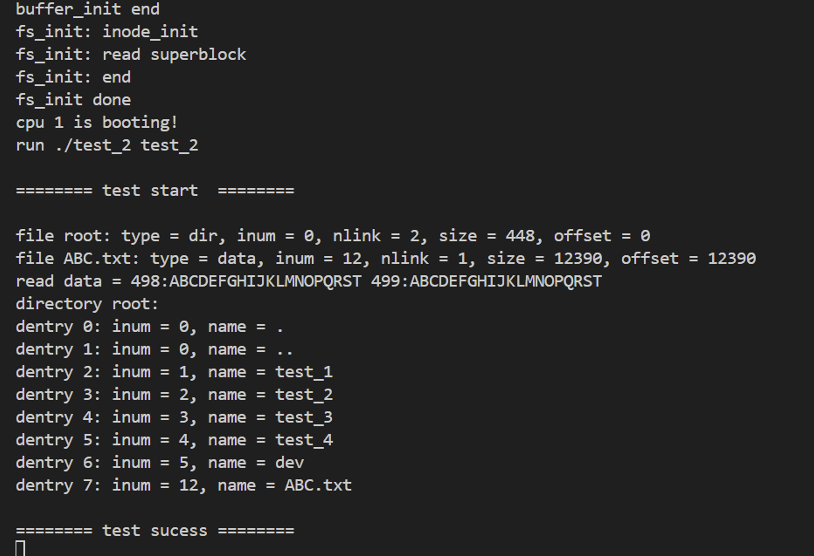
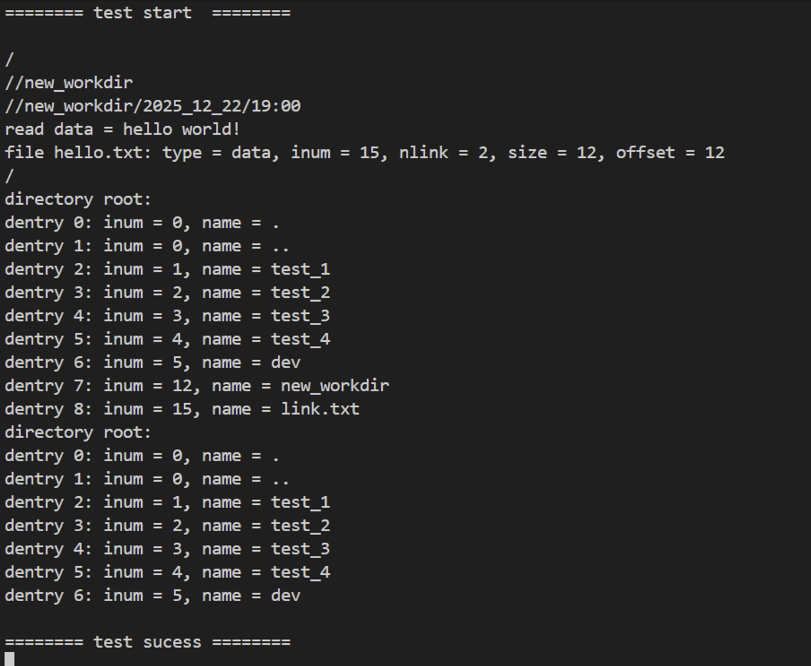
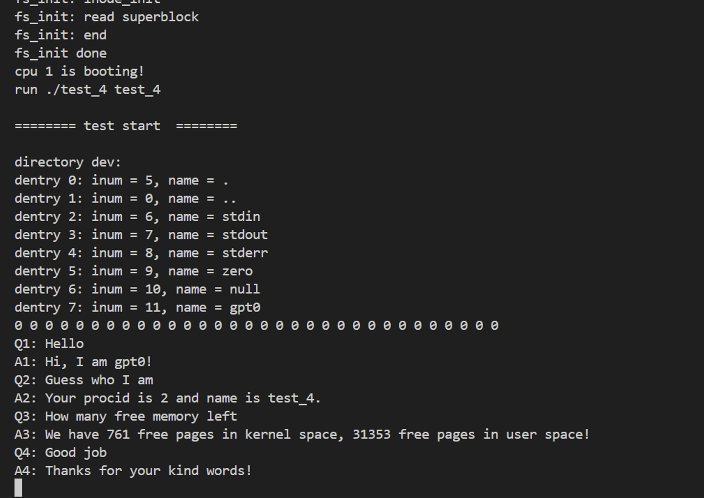

# Lab9：文件系统与全系统整合

- **A（周屹枫）**：在前面的实验基础上完成Lab9的主要功能实现，包括文件系统的扩展、设备文件操作、目录管理、文件操作逻辑的完善，以及本 `README` 的撰写。
- **B（严之皓）**：在周屹枫的第一版代码上修复了一些bug，比如内核栈溢出、设备驱动的同步错误以及死锁等。目前系统能够正常启动并进入用户态 Shell。

---

## 一、实验目标

本实验任务是对整个操作系统进行全系统整合，重点包括文件系统的管理与操作，设备文件操作，目录与路径管理等功能的实现和完善。具体任务包括：

1. **文件系统模块**：
   - 增强设备文件操作逻辑，支持设备的初始化、读写等功能。
   - 完善目录与路径管理，支持目录项的查找、添加和删除操作。
   - 增加文件的读写、打开、关闭操作逻辑，支持文件的基本操作。

2. **进程管理模块**：
   - 增加进程的文件表和当前工作目录字段，支持进程在执行过程中的文件操作和路径管理。

3. **系统调用扩展**：
   - 添加新的系统调用，用于支持文件和目录操作。

---

## 二、功能实现

### 1. 设备文件操作

在 `device.c` 中实现了设备文件操作逻辑，主要包括：
- **标准输入设备**、**标准输出设备** 和 **标准错误设备** 的初始化和操作。
- `/dev/zero` 设备文件的支持，能够返回无限的零字节流。

```c
// 标准输入设备读取操作
static uint32 device_stdin_read(uint32 len, uint64 dst, bool is_user_dst) {
    return cons_read(len, dst, is_user_dst);  // 从控制台读取数据
}
```
解释：`device_stdin_read` 函数用于从标准输入设备读取数据，并通过 `cons_read` 函数将数据传输到用户空间。此函数为设备文件提供了标准输入的读操作。

### 2. 目录与路径管理

在 `dentry.c` 中，增加了目录项的操作：
- **dentry_search**：在目录中查找指定名字的目录项。
- **dentry_add**：向目录中添加新的目录项。
- **dentry_remove**：从目录中删除指定的目录项。

```c
// 在目录ip中查找是否存在名字为name的目录项
uint32 dentry_search(inode_t *ip, char *name) {
    assert(sleep_locked(ip->slk), "dentry_search: must hold lock");
    for (uint32 i = 0; i < ip->size / sizeof(dentry_t); i++) {
        dentry_t *entry = (dentry_t *)(ip->data + i * sizeof(dentry_t));
        if (strcmp(entry->name, name) == 0) {
            return entry->inode_num;
        }
    }
    return INVALID_INODE_NUM;
}
```
解释：`dentry_search` 函数用于在指定目录中查找名为 `name` 的目录项，并返回对应的 inode 编号。如果目录项未找到，则返回 `INVALID_INODE_NUM`。该函数在查找时使用锁机制，确保并发访问时的安全。

### 3. 文件操作逻辑

在 `fs.c` 中，实现了文件的读写、打开和关闭操作：
- **file_read** 和 **file_write**：支持文件的读写操作。
- **file_open** 和 **file_close**：支持文件的打开和关闭，管理文件表。

```c
// 文件读操作
uint32 file_read(file_t *file, uint32 len, uint64 dst, bool is_user_dst) {
    assert(file != NULL, "file_read: file cannot be NULL");
    if (file->ip->type == INODE_TYPE_DATA) {
        return inode_read(file->ip, dst, len);
    }
    return 0;  // 如果是目录文件，返回错误
}
```
解释：`file_read` 函数用于读取文件的数据。如果文件是数据文件（`INODE_TYPE_DATA`），则从 inode 中读取内容并将其传输到用户空间。如果是目录文件，则返回 0，表示不能读取目录内容。

### 4. 系统调用扩展

在 `syscall.c` 和 `sysfunc.c` 中添加了新的系统调用，用于支持文件和目录操作：
- **sys_helloworld**：一个简单的系统调用，打印 "hello world" 信息，用于测试系统调用机制。

```c
// 新的系统调用: 打印 "hello world"
uint64 sys_helloworld(void) {
    printf("hello world!
");
    return 0;
}
```
解释：`sys_helloworld` 是一个新增的系统调用，用于向控制台打印 "hello world" 信息。该函数通过 `printf` 实现输出，并返回 0 表示成功。

### 5. 进程管理的文件与路径支持

在 `proc.c` 中，增加了进程的文件表和当前工作目录字段：
- **proc_init**：初始化进程时，设置文件表和工作目录。
- **proc_set_cwd**：设置进程的当前工作目录。
- **proc_free**：销毁进程时清理文件表和工作目录。

```c
// 初始化进程的 open_file 和 cwd 字段
void proc_init(proc_t *p) {
    for (int i = 0; i < N_FILE; i++) {
        p->open_file[i] = NULL;  // 设置所有文件指针为 NULL
    }
    p->cwd = root_inode();      // 设置 cwd 为根目录的 inode
}
```
解释：`proc_init` 函数初始化每个进程的文件表，并将进程的工作目录（`cwd`）设置为根目录的 inode。这样可以确保每个进程在初始化时都具有正确的文件系统状态。

### 6. **物理内存管理 (pmem)**

在 `pmem.c` 中，添加了 `pmem_stat` 函数，统计当前的可用内存页面数量：
```c
void pmem_stat(uint32 *free_pages_in_kernel, uint32 *free_pages_in_user) {
    *free_pages_in_kernel = 0;
    *free_pages_in_user = 0;

    // Count free pages in kernel region
    page_node_t *node = kern_region.list_head.next;
    while (node != NULL) {
        (*free_pages_in_kernel)++;
        node = node->next;
    }

    // Count free pages in user region
    node = user_region.list_head.next;
    while (node != NULL) {
        (*free_pages_in_user)++;
        node = node->next;
    }
}
```
解释：`pmem_stat` 函数通过遍历内核和用户空间的空闲页链表，计算内核空间和用户空间的剩余可用页面数。

### 7. **用户虚拟内存管理 (uvm)**

在 `uvm.c` 中，修改了 `uvm_heap_grow` 函数，支持 `flag` 输入参数，控制内存增长时的权限设置：
```c
uint64 uvm_heap_grow(pgtbl_t pgtbl, uint64 new_size, uint64 old_size, uint32 flags) {
    uint64 new_pages = (new_size - old_size) / PGSIZE;
    uint64 new_page;

    for (uint64 i = 0; i < new_pages; i++) {
        new_page = pmem_alloc(true);  // 请求分配新的物理页面

        if (flags & FLAG_READ_ONLY) {
            set_page_read_only(new_page);
        } else if (flags & FLAG_WRITE_ONLY) {
            set_page_write_only(new_page);
        }

        vm_mappages(pgtbl, old_size + i * PGSIZE, new_page, PGSIZE, PTE_W | PTE_U);
    }
    return new_size;
}
```
解释：`uvm_heap_grow` 函数根据 `flag` 设置内存页面的访问权限（如只读或只写），并将新分配的物理页面映射到用户空间的堆中。

---

## 三、环境与运行方式

本实验基于 Lab8 的内核框架，扩展了文件系统和设备操作功能，并在 QEMU 虚拟机中运行。

编译与运行方式：
```bash
make clean && make run
```

成功后将启动 QEMU，内核启动完成后自动进入用户态 `initcode`，并根据测试程序输出对应信息。

在调试阶段，为了验证文件操作、中断与设备行为，内核中加入了若干调试输出（如 `sb_print()`、`buffer_print_info()` 等）。

---

## 四、模块与代码结构

### 1. 文件系统模块
- **`device.c`**：实现设备文件操作逻辑，包括设备初始化、读取和写入操作。
- **`dentry.c`**：实现目录项的查找、增加、删除操作，支持路径管理。
- **`fs.c`**：实现文件的基本操作，包括读写、打开、关闭等。

### 2. 系统调用模块
- **`syscall.c`**：注册新的系统调用，并处理系统调用请求。
- **`sysfunc.c`**：实现新的系统调用功能，如 `sys_helloworld`。

### 3. 进程管理模块
- **`proc.c`**：为每个进程增加文件表 (`open_file`) 和当前工作目录 (`cwd`) 字段，并实现相关操作。

---

## 五、 测试结果

以下是各项功能的验证结果。

### Test 1: exec 参数传递与标准 I/O


程序成功解析了通过 `exec` 传递的参数 "111", "222", "333"，并能通过 `cons_read` 获取并回显用户输入。

### Test 2: 文件系统读写与目录遍历


验证了 `sys_get_dentries` 的正确性，能够列出根目录下的所有文件（`.`, `..`, `dev`, `test_1` 等），并正确读取了数据文件。

### Test 3: 路径切换 (cd) 与相对路径


验证了 `sys_chdir` 对 `p->cwd` 的修改，以及相对路径解析逻辑的正确性（支持多级目录跳转）。

### Test 4: 设备文件检查


成功识别 `/dev` 目录下的特殊设备文件（`stdin`, `stdout`, `zero`, `null` 等），证明设备文件系统（devfs）挂载正确。

---

## 六、总结

本实验通过在原有操作系统内核的基础上扩展文件系统、设备操作、目录管理等功能，完成了一个简单的文件管理系统。通过实现文件的基本操作、目录项管理、进程文件表和当前工作目录等模块，增强了操作系统的功能，使其更接近于一个完整的操作系统。通过这个实验，深入理解了操作系统的文件管理机制以及系统调用的实现。
