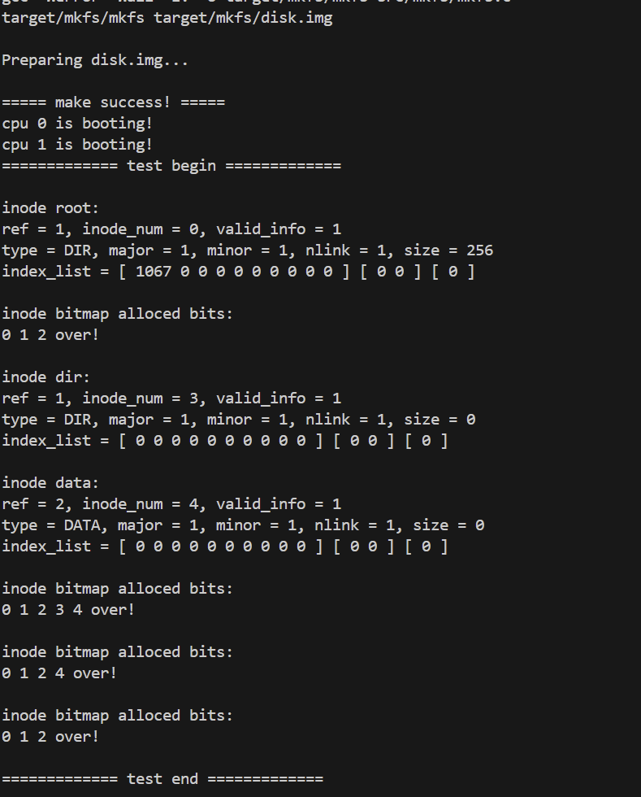
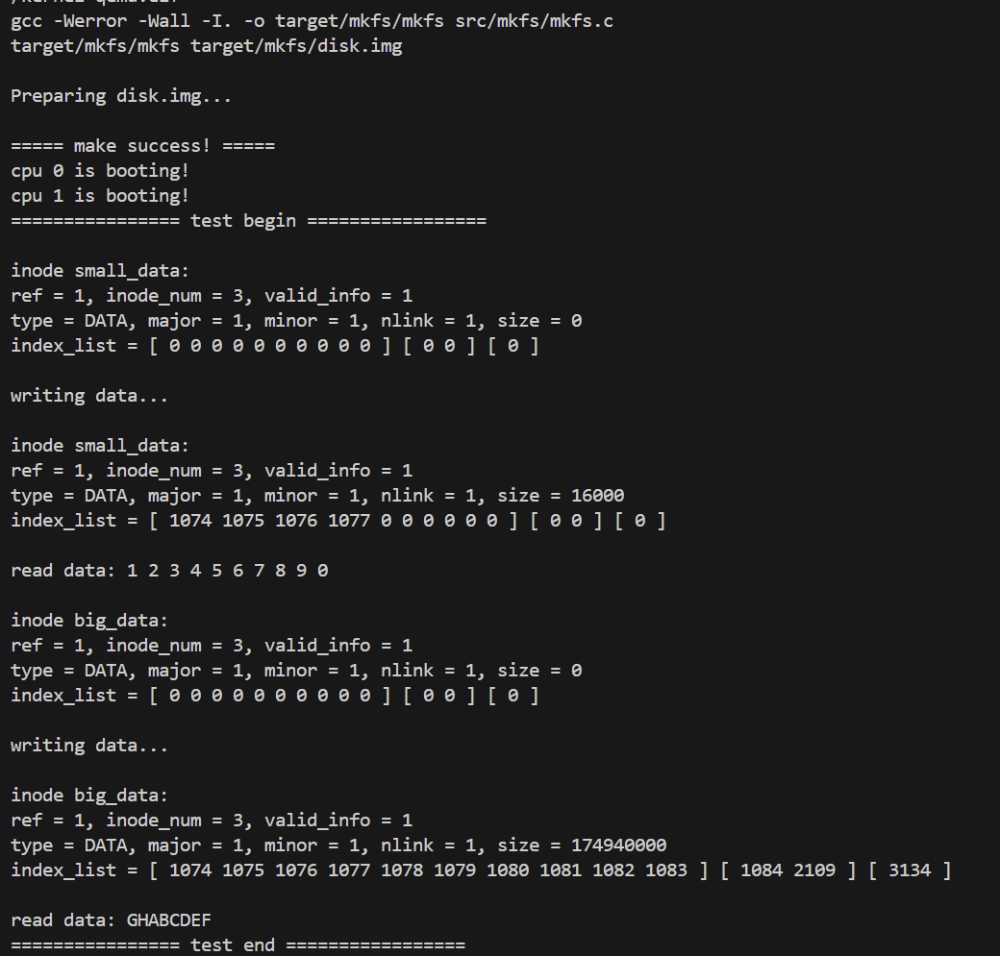
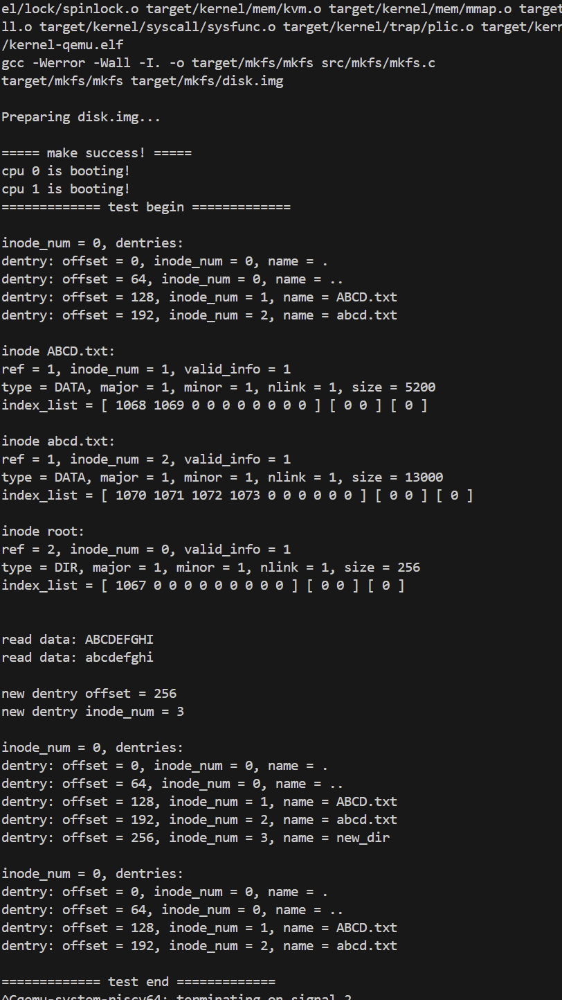
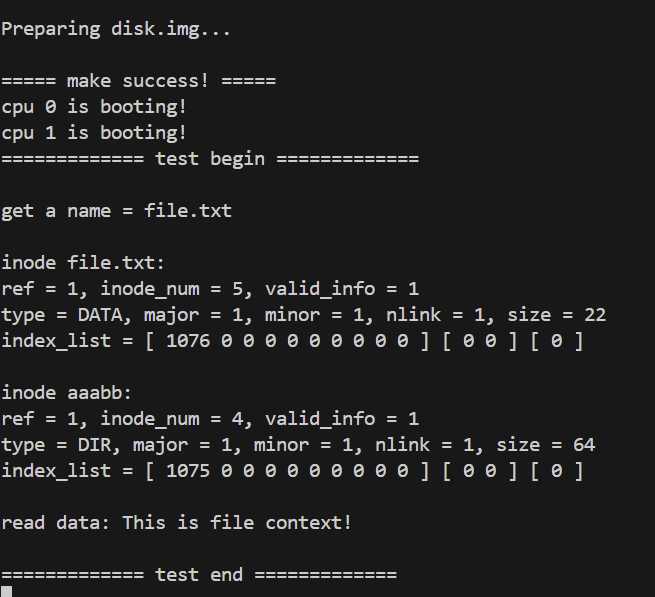

# Lab 8

本次实验从 Block-level 的磁盘读写抽象进一步提升，构建一个完整的、支持变长文件（Inode）和层次化目录（Dentry）的文件系统。

---

## 一、Inode 生命周期与同步

在内存中维护 Inode 状态，并实现内存 Inode (`inode_t`) 与磁盘 Inode (`inode_disk_t`) 的双向同步。

### 初始化

首先，我们需要初始化管理内存 Inode 的全局结构。

```c
void inode_init()
{
	spinlock_init(&lk_inode_cache, "inode_cache");
	for (int i = 0; i < N_INODE; i++) {
		inode_t *ip = &inode_cache[i];
		ip->valid_info = false;
		ip->inode_num = 0;
		ip->ref = 0;
		memset(&ip->disk_info, 0, sizeof(inode_disk_t));
		sleeplock_init(&ip->slk, "inode");
	}
}
```
*   始化 `lk_inode_cache` 自旋锁，用于保护 `inode_cache` 数组的并发访问（如分配、引用计数修改）。
*   遍历 `inode_cache` 数组，将所有槽位的 `valid_info` 置为 `false`，表示该槽位未关联有效磁盘数据；初始化 `ref` 为 0，表示空闲；并为每个 Inode 初始化一个睡眠锁 `slk`，用于后续对单个 Inode 的独占操作（特别是涉及磁盘 I/O 时）。

### 磁盘同步

```c
void inode_rw(inode_t *ip, bool write)
{
	assert(sleeplock_holding(&ip->slk), "inode_rw: slk");

	uint32 block_num = sb.inode_firstblock + ip->inode_num / INODE_PER_BLOCK;
	uint32 byte_offset = (ip->inode_num % INODE_PER_BLOCK) * sizeof(inode_disk_t);

	buffer_t *buf = buffer_get(block_num);
	if (write) {
		memmove(buf->data + byte_offset, &ip->disk_info, sizeof(inode_disk_t));
		buffer_write(buf);
	} else {
		memmove(&ip->disk_info, buf->data + byte_offset, sizeof(inode_disk_t));
	}
	buffer_put(buf);
}
```
*   根据 `inode_num` 计算物理地址。
    *   `block_num`：`inode_region` 起始块 + (`inode_num` / 每块 Inode 数)。
    *   `byte_offset`：(`inode_num` % 每块 Inode 数) * Inode 大小。
*   调用 buffer_get 来读取这块缓冲区的内容。
*   读写分流。
    *   `write=true`：将内存里的 `ip->disk_info` 覆盖到 Buffer 对应偏移处，并调用 `buffer_write` 标记脏页刷盘。
    *   `write=false`：将 Buffer 中的数据加载到内存 `ip->disk_info`。

### 资源获取与分配

实现了类似 LRU 的资源获取逻辑。

```c
inode_t *inode_get(uint32 inode_num)
{
	inode_t *ip = NULL;
	spinlock_acquire(&lk_inode_cache);

	/* 1. 尝试在缓存中查找 */
	for (int i = 0; i < N_INODE; i++) {
		if (inode_cache[i].ref > 0 && inode_cache[i].inode_num == inode_num) {
			ip = &inode_cache[i];
			ip->ref++;
			spinlock_release(&lk_inode_cache);
			return ip;
		}
	}

	/* 2. 查找空闲槽位 */
	for (int i = 0; i < N_INODE; i++) {
		if (inode_cache[i].ref == 0) {
			ip = &inode_cache[i];
			ip->inode_num = inode_num;
			ip->valid_info = false; // 标记数据无效，需要 inode_lock 时加载
			ip->ref = 1;
			spinlock_release(&lk_inode_cache);
			return ip;
		}
	}
    // panic handling
    spinlock_release(&lk_inode_cache);
	panic("inode_get: no free inode");
	return NULL;
}
```
*   Cache Hit：遍历数组，如果发现 `inode_num` 匹配且 `ref > 0`，直接增加引用计数返回。
*   Cache Miss：寻找 `ref == 0` 的空闲位。将 `valid_info` 设为 `false`，这会迫使后续的 `inode_lock` 调用 `inode_rw` 从磁盘拉取最新数据。

### 资源释放与删除

```c
void inode_put(inode_t* ip)
{
	spinlock_acquire(&lk_inode_cache);
    // ...
	if (ip->ref == 1 && ip->valid_info && ip->disk_info.nlink == 0) {
		spinlock_release(&lk_inode_cache);

		inode_lock(ip);
		/* 删除inode并释放资源 */
		inode_delete(ip);
		inode_unlock(ip);
        // ... 重置 ref, valid_info 等 ...
		return;
	}

	ip->ref--;
	spinlock_release(&lk_inode_cache);
}
```
当一个文件的引用计数降到零（也就是 ip->ref 从 1 减到 0），同时它的硬链接数 nlink 也已经是零，就说明这个文件在内存和磁盘上都没人用了，这时候系统会调用 inode_delete 把它占的 block 和 inode 位图资源回收掉。

### Test 1 运行结果

*可以看到 Inode root (num=0), dir (num=3), data (num=4) 被正确创建、打印，位图分配与回收逻辑正确。*

---

## 二、数据映射与流读写

实现逻辑块号到物理块号的三级映射，并支持大文件的读写。

### 三级索引映射

这部分逻辑基本都在 `locate_or_add_block` 里面实现。

#### (1) 直接映射与一级间接映射
```c
	/* 直接映射 (0-9) */
	if (logical_block_num < INODE_BLOCK_INDEX_1) {
		uint32 *p = &inode_index[logical_block_num];
		if (*p == 0) {
			uint32 bnum = bitmap_alloc_block();
            // ... 错误处理 ...
			*p = bnum;
		}
		return *p;
	}

	/* 一级间接映射 (10 - 1033) */
	if (logical_block_num < INODE_BLOCK_INDEX_2) {
		// ... 计算 inner 偏移 ...
		uint32 *p_index_block = &inode_index[INODE_INDEX_1 + idx_block_idx];
		if (*p_index_block == 0) {
            // 如果索引块本身不存在，先分配索引块并清零
			uint32 new_block = bitmap_alloc_block();
            // ...
			*p_index_block = new_block;
            // ... buffer_write(0) 初始化 ...
		}
        // 读取索引块，找到对应条目，若为0则分配数据块
        // ...
	}
```
*   无论是直接指向的数据块，还是中间的索引块，只要发现为 0，那就说明这个逻辑块目前没有对应的物理块，立即调用 `bitmap_alloc_block` 分配。
*   分配新的索引块后，得先用 memset 把 b->data 清零，再写回磁盘，否则可能读到残留的脏数据，误指到别的块上。

#### (2) 二级间接映射
```c
	/* 二级间接映射 */
	// ... 
	if (inode_index[INODE_INDEX_2] == 0) {
        // 分配一级索引块
		inode_index[INODE_INDEX_2] = new_block;
        // ...
	}

	buffer_t *b_idx_idx = buffer_get(inode_index[INODE_INDEX_2]);
	uint32 *idx_idx_base = (uint32 *)b_idx_idx->data;
	if (idx_idx_base[idx_idx] == 0) {
        // 分配二级索引块
		idx_idx_base[idx_idx] = new_index_block;
        // ...
	}
    // ... 最后找到数据块 ...
```
这里实现了“索引的索引”。逻辑与一级间接类似，只是多了一层 `buffer_get`。先获取 Level-1 Index Block，从中读出 Level-2 Index Block 的块号，再从中读出最终的数据块号。

### 数据流读写

以 `inode_write_data` 为例：

```c
uint32 inode_write_data(inode_t *ip, uint32 offset, uint32 len, void *src, bool is_user_src)
{
    // ... 长度校验 ...
	while (done < len) {
        // ... 计算逻辑块号 logical_block 和块内偏移 block_off ...
		uint32 block_num = locate_or_add_block(ip->disk_info.index, logical_block);
        if (block_num == (uint32)-1)
			break;
        
		buffer_t *b = buffer_get(block_num);
		if (is_user_src) {
			uvm_copyin(myproc()->pgtbl, (uint64)(b->data + block_off), (uint64)src + done, cut);
		} else {
			memmove(b->data + block_off, (uint8 *)src + done, cut);
		}
		buffer_write(b); // 标记脏
		buffer_put(b);
		done += cut;
	}
    // 更新 inode size 并同步
    uint32 new_size = offset + done;
	if (new_size > ip->disk_info.size) {
		ip->disk_info.size = new_size;
        inode_rw(ip, true);
    }
}
```
这个函数把块设备的离散特性藏了起来，对外表现为一个普通的字节流接口。

它通过 locate_or_add_block 自动搞定扩容，每次读写时只处理 MIN(len, BLOCK_SIZE - off) 这么多字节，保证操作不会跨块，始终落在单个 Buffer 内。

### Test 2 运行结果


*可以看到 `inode big_data` 的 size 达到了 174,940,000 (约 174MB)，`index_list` 中出现了 `1084` (一级间接) 和 `3134` (二级间接) 等块号，证明多级索引工作正常。*

不过我这里测试对于 fs.c 做了一些修改。原始测试代码在当前的内核物理内存环境下，会直接报出 `panic! pmem_alloc: out of memory` 然后退出。

稍微研究了一下，测试代码尝试写入大约 175MB 的数据（17.5KB × 10000）。系统为 Buffer Cache 分配了 16384 个槽位，相当于 64MB 的缓存空间，文件系统据此认为自己可以同时缓存这么多磁盘块。但物理内存管理器手里只有 1024 个页面，总共才 4MB。

随着写入持续进行，文件系统不断调用 block_alloc 获取新块，并通过 buffer_get 将其载入缓存。由于缓存槽位远未用完，buffer_get 不会触发驱逐机制，而是直接向物理内存申请新页。当写入量超过 4MB 后，物理页被耗尽，pmem_alloc 要么失败，要么返回无效地址，最终引发内核 panic 或非法指令异常。

我的修改：

```c
       printf("writing data...\n\n");
       // 修改点：将循环次数从 10000 减少到 100，cut_len 保持不变
       cut_len = PGSIZE * 4 + 1110;
       for (uint32 offset = 0; offset < cut_len * 100; offset += cut_len) // 这里原先是更大的循环
       {
               len = inode_write_data(ip_2, offset, cut_len, big_src, false);
               assert(len == cut_len, "write fail 2!");
       }
```

调整为 100 次循环后，测试数据的总量约为 1.75MB，远小于 4MB 的物理内存上限。这确保了在 Buffer Cache 不进行激进回收的情况下，测试也能在内存中完整运行。

而且虽然数据量减少，但 1.75MB 依然远超文件系统 Direct Mapping 覆盖的 40KB 范围。

这迫使 `locate_or_add_block` 函数必须跨越边界，分配并使用一级间接索引块。如果逻辑有误，文件读写将在第 11 个块之后失败，因此感觉该测试依然能验证间接寻址逻辑的正确性。保留 `cut_len = PGSIZE * 4 + 1110` ，确保了每次写入都会产生跨块操作。这依然能检测 `inode_write_data` 中关于 block offset 和 buffer copy 的边界处理逻辑。

---

## 三、目录项管理

将目录视为包含 `dentry_t` 数组的特殊文件。这一部分主要是在写 `src/kernel/fs/dentry.c`。

### 目录搜索

```c
uint32 dentry_search(inode_t *ip, char *name)
{
    // ... 检查类型为 DIR ...
	buffer_t *buf = buffer_get(ip->disk_info.index[0]);
	dentry_t *de = (dentry_t *)(buf->data);

	for (uint32 i = 0; i < DENTRY_PER_BLOCK; i++, de++) {
		if (de->name[0] == 0) continue; // 跳过无效项
		if (strncmp(de->name, name, MAXLEN_FILENAME) == 0) {
			ret = de->inode_num;
			break;
		}
	}
	buffer_put(buf);
	return ret;
}
```
* 直接读取目录的第 0 个数据块（这里目录不超过 1 块，来自README的好心）。

  > 对于**INODE_TYPE_DIR**类型的inode, 我们假设它只使用1个block(index[0]记录), size只代表有效数据量 (接受空洞)

* 将数据块强制转换为 `dentry_t` 数组进行遍历。`name[0] == 0` 是我们定义的空闲/无效标记。

### 目录项创建

```c
uint32 dentry_create(inode_t *ip, uint32 inode_num, char *name)
{
    // ... 如果 index[0] 为空则分配 ...
	buffer_t *buf = buffer_get(ip->disk_info.index[0]);
    
	for (uint32 i = 0; i < DENTRY_PER_BLOCK; i++) {
        // ... 查重逻辑 ...
		if (free_slot == NULL) { // 记录第一个空槽位
			free_slot = de;
			free_off = i * sizeof(dentry_t);
		}
	}

    // ... 填充 free_slot ...
	memset(free_slot, 0, sizeof(dentry_t));
	memmove(free_slot->name, name, MAXLEN_FILENAME - 1);
	free_slot->inode_num = inode_num;

	buffer_write(buf); // 落盘
    // ... 更新 ip->size ...
}
```
*   这里用首次适应策略分配空间，能复用已被删除文件留下的空闲槽位。
*   每次新建文件后，目录项对应的 Inode 的 size 字段都会更新，确保反映当前已用空间的最大字节偏移。

### Test 3 运行结果


*可以看到 `new_dir` 被创建在 offset 256 处，删除后再次打印目录，该项消失，证明 Dentry 增删逻辑正确。*

---

## 四、路径解析

实现 `path_to_inode`，支持 `/A/B/C` 格式的查找。

### 路径解析

```c
static inode_t* __path_to_inode(char *path, char *name, bool find_parent_inode)
{
	inode_t *ip = inode_get(ROOT_INODE);
	inode_lock(ip); // 从根节点开始

	while (1) {
		path = get_element(path, name); // 提取当前层级名字，如 "A"
		if (path == NULL || name[0] == 0) break;

        // ... find_parent_inode 的特殊返回逻辑 ...

		uint32 inode_num = dentry_search(ip, name);
        // ... 没找到则 unlock put return NULL ...

        // 步进到下一级
		inode_t *next = inode_get(inode_num);
		inode_lock(next);
		inode_unlock(ip);
		inode_put(ip);
		ip = next;
	}
    // ...
	return ip;
}
```
*   查找过程通过 get_element 函数逐级解析路径字符串。
*   这里要交替加锁，进入下一级目录 next 之前，先对 next 加锁，再释放当前节点 ip 的锁。

### Test 4 运行结果

*系统成功根据路径 `///AABBC///aaabb/file.txt`找到了对应的 inode (num=5)，并正确读取了内容 "This is file context!"。*