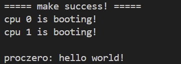
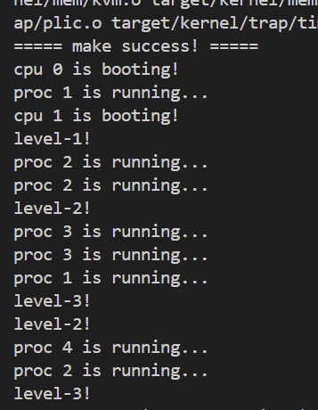
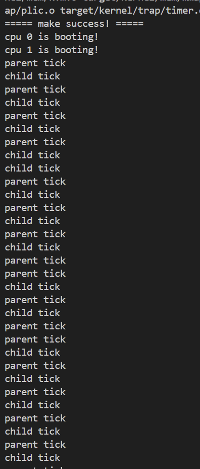
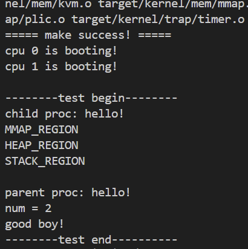
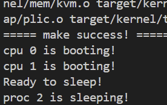
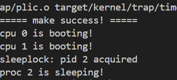
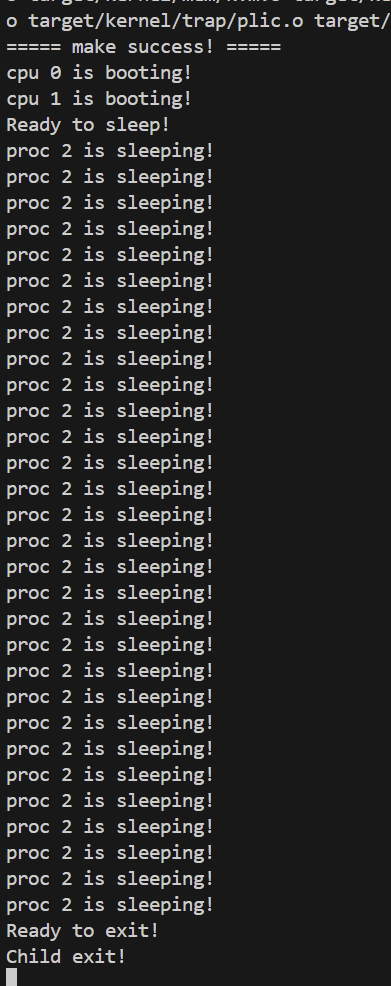

# Lab 6

## 项目运行与环境

通过 `make qemu` 启动系统。

## 一: 进程初始化与内核栈

### 实现

在单进程基础上，我们需要引入进程数组 `proc_list` 来管理多个进程。每个进程需要独立的内核栈(`kstack`)，以确保在内核态执行时互不干扰。

`src/kernel/mem/kvm.c`:
我们将内核栈的映射逻辑从单栈改为遍历 `N_PROC` 个进程槽位，为每个进程分配物理页并在内核页表中建立固定虚拟地址的映射。

```c
void kvm_init() {
	// ... (初始化内核页表)
 
 	// 预先为每个进程槽位准备一页内核栈，切换时使用固定虚拟地址
 	for (int i = 0; i < N_PROC; i++) {
  		uint64 va = KSTACK(i);
  		uint64 pa = (uint64)pmem_alloc(true);
  		assert(pa != 0, "kvm_init: no mem for kstack");
  		memset((void *)pa, 0, PGSIZE);
  		vm_mappages(kernel_pgtbl, va, pa, PGSIZE, PTE_R | PTE_W);
 	}
}
```

`src/kernel/proc/proc.c`):
`proc_alloc` 负责从 `proc_list` 中寻找空闲槽位(`UNUSED`)，初始化进程控制块。

```c
proc_t *proc_alloc() {
 	for (int i = 0; i < N_PROC; i++) {
  		proc_t *p = &proc_list[i];
  		spinlock_acquire(&p->lk); // 获取锁以保证互斥访问
  		if (p->state != UNUSED) {
            spinlock_release(&p->lk);
            continue;
  		}
  
        // 初始化 PID, 内核栈, trapframe 等
        p->pid = alloc_pid();
        p->state = USED;
        // ...
        return p;
 	}
 	return NULL;
}
```

### 测试验证



系统成功启动双核，并由 PID 为 1 的 proczero 打印了 "hello world!"，证明进程结构体和内核栈初始化正确。

追加内核栈隔离的测试：

在内核初始化阶段探查 `KSTACK` 宏计算的虚拟地址，验证不同进程的内核栈之间是否存在隔离页（Guard Page）。

```c
#include "mod.h"
#include "type.h"
#include "../proc/type.h"

void kstack_probe(void) {
 	for (int i = 0; i < 4; i++) {
  		uint64 va = KSTACK(i);
  		printf("kstack[%d] va = %p\n", i, va);
 	}
 	printf("delta = %d\n", (long)(KSTACK(0) - KSTACK(1)));
}
```

.png)

相邻内核栈的虚拟地址差值为 `8192` (2 * PGSIZE)，即一个栈页(4KB)加上一个保护页(4KB)，证明隔离布局正确。

---

## 二: 轮转调度

### 实现

多进程调度靠 scheduler 的线程，配合 swtch 完成上下文切换。

`src/kernel/proc/proc.c`):
`proc_scheduler` 是每个 CPU 核心的空闲循环，它不断扫描进程数组，找到 `RUNNABLE` 的进程并切换过去。

```c
void proc_scheduler() {
 	struct cpu *c = mycpu();
 	while (1) {
        intr_on(); // 开启中断，避免死锁
        for (int i = 0; i < N_PROC; i++) {
            proc_t *p = &proc_list[i];
            spinlock_acquire(&p->lk);
            if (p->state == RUNNABLE) {
                p->state = RUNNING;
                c->proc = p;
                swtch(&c->ctx, &p->ctx); // 切换到进程上下文
                c->proc = NULL;
            }
            spinlock_release(&p->lk);
        }
 	}
}
```

`proc_fork` 实现了进程的复制，包括深拷贝用户地址空间和 trapframe。

```c
int proc_fork() {
 	proc_t *parent = myproc();
 	proc_t *child = proc_alloc();
 	// 复制 trapframe, 栈, 堆等元数据
 	memmove(child->tf, parent->tf, sizeof(trapframe_t));
 	child->tf->a0 = 0; // 子进程返回值为 0
 	// 复制页表
 	uvm_copy_pgtbl(parent->pgtbl, child->pgtbl, ...);
 
 	child->state = RUNNABLE; // 子进程就绪
 	return child->pid;
}
```

### 测试验证

通过连续 `fork` 创建多个进程，观察它们是否并发执行。

运行结果:



日志中 `level-2!` 和 `level-3!` 以及 `proc X is running...` 交替出现，表明父子进程被分配到了不同的 CPU 或在同一 CPU 上轮转执行，调度器工作正常。

---

## 三: 时钟抢占

### 实现

为了防止进程独占 CPU，我们在时钟中断处理中加入抢占逻辑。

`src/kernel/trap/trap_kernel.c` & `trap_user.c`:
当发生 S-mode 时钟中断 (trap_id=5) 或软件中断 (trap_id=1) 时，如果当前有进程在运行，则调用 `proc_yield`。

```c
void trap_user_handler() {
 	// ...
 	switch (trap_id) {
  	case 5: // Timer interrupt
		timer_interrupt_handler();
		if (c->proc != NULL && c->proc->state == RUNNING)
 			proc_yield(); // 强制让出 CPU
		break;
 	}
}
```

`src/kernel/proc/proc.c`:
`proc_yield` 将进程状态改回 `RUNNABLE` 并调用调度器。

```c
void proc_yield() {
 	proc_t *p = myproc();
 	spinlock_acquire(&p->lk);
 	p->state = RUNNABLE;
	proc_sched(); // 切换回调度器
 	spinlock_release(&p->lk);
}
```

### 测试验证

补充测试：

父子进程各自执行死循环并打印 tick，验证是否会自动切换。

```c
#include "sys.h"

int main()
{
 	int pid = syscall(SYS_fork);
 	while (1) {
  		if (pid == 0)
			syscall(SYS_print_str, "child tick\n");
  		else
			syscall(SYS_print_str, "parent tick\n");
  		// 小步忙等，依赖时钟中断抢占
  		for (volatile int i = 0; i < 200000; i++)
			;
 	}
}
```



即便父子进程都在执行 `while(1)` 死循环，输出依然是交替的。这证明时钟中断成功打断了当前进程，强制触发了调度。

抢占下的 Fork 测试：

.png)

在开启抢占的情况下，多进程并发打印依然正常工作。

---

## 四: 进程生命周期

### 实现

实现完整的 `exit` 和 `wait` 机制，确保进程资源能被正确回收，避免僵尸进程。

`src/kernel/proc/proc.c`):

`proc_exit`: 进程结束时，标记为 `ZOMBIE`，唤醒父进程，并将子进程过继给 `proczero`。
`proc_wait`: 父进程遍历 `proc_list`，查找 `ZOMBIE` 状态的子进程，释放其内核栈和页表。

```c
void proc_exit(int exit_code) {
     proc_t *p = myproc();
     p->exit_code = exit_code;
     proc_reparent(p);// 过继子进程
     proc_wakeup(p->parent);// 唤醒父进程
     p->state = ZOMBIE;
     proc_sched(); // 调度出去，不再返回
     panic("unreachable");
}
```

### 测试验证

子进程操作内存后退出，父进程等待并检查退出码。



子进程成功打印了各内存段内容并退出，父进程成功 `wait` 到了子进程并获取了正确的退出码 `1234` (打印 "good boy!")，证明生命周期管理完整。

---

## 五: 睡眠与唤醒

### 实现

为了提高效率，我们将 `wait` 的实现从轮询改为睡眠等待。

`src/kernel/proc/proc.c`:

`proc_sleep(chan, lk)`: 原子地释放锁 `lk` 并将进程状态置为 `SLEEPING`，记录睡眠通道 `chan`。
`proc_wakeup(chan)`: 唤醒所有在 `chan` 上睡眠的进程。

```c
void proc_sleep(void *sleep_space, spinlock_t *lock) {
     proc_t *p = myproc();
     // 必须持有锁进入，以保护 sleep_space 的设置和状态切换的原子性
     if (lock != &p->lk) {
          spinlock_acquire(&p->lk);
          spinlock_release(lock);
     }
     p->sleep_space = sleep_space;
     p->state = SLEEPING;
     proc_sched(); // 切换进程
     // ... 醒来后重新获取锁
}
```

### 测试验证

验证 `sleep` 系统调用。

```c
#include "sys.h"

int main()
{
    int pid = syscall(SYS_fork);
    if (pid == 0) {
        syscall(SYS_print_str, "Ready to sleep!\n");
        syscall(SYS_sleep, 30);
        syscall(SYS_print_str, "Ready to exit!\n");
        syscall(SYS_exit, 0);
    } else {
        syscall(SYS_wait, 0);
        syscall(SYS_print_str, "Child exit!\n");
    }
    while(1);
}
```



---

## 六: 睡眠锁

### 实现

实现一种长周期的锁 `sleeplock`，当获取锁失败时，进程会睡眠而不是自旋，从而释放 CPU 给其他进程使用。

`src/kernel/lock/sleeplock.c`:

```c
void sleeplock_acquire(sleeplock_t *lk) {
	while (1) {
    	spinlock_acquire(&lk->lock);
        if (!lk->locked) {
        	lk->locked = 1; // 获取锁成功
            lk->pid = myproc()->pid;
            spinlock_release(&lk->lock);
            break;
         }
         // 获取失败，在 lk 上睡眠
         proc_sleep(lk, &lk->lock);
	}
}

void sleeplock_release(sleeplock_t *lk) {
	spinlock_acquire(&lk->lock);
    lk->locked = 0;
    lk->pid = -1;
    proc_wakeup(lk); // 唤醒等待该锁的进程
    spinlock_release(&lk->lock);
}
```

### 测试验证

两个子进程竞争同一个睡眠锁。

```c
#include "sys.h"

int main()
{
    int pid = syscall(SYS_fork);
    if (pid == 0) {
        for (int i = 0; i < 3; i++) {
            syscall(SYS_sleeplock_acquire);
            syscall(SYS_sleep, 5);
            syscall(SYS_sleeplock_release);
            syscall(SYS_sleep, 1);
        }
        syscall(SYS_exit, 0);
    }

    int pid2 = syscall(SYS_fork);
    if (pid2 == 0) {
        for (int i = 0; i < 3; i++) {
            syscall(SYS_sleeplock_acquire);
            syscall(SYS_sleep, 5);
            syscall(SYS_sleeplock_release);
            syscall(SYS_sleep, 1);
        }
        syscall(SYS_exit, 0);
    }

    int code = 0;
    syscall(SYS_wait, &code);
    syscall(SYS_wait, &code);
    while (1);
    return 0;
}

```



进程 2 获取锁后进入睡眠，其他尝试获取锁的进程将会阻塞(sleep)，直到进程 2 释放锁。

---

## 七: 基于时钟的睡眠

### 实现

完善 `sys_sleep`，使其利用内核的时钟中断进行唤醒，而不是忙等。

`src/kernel/trap/timer.c`:

`timer_wait`: 循环检查系统滴答数 `sys_timer.ticks`。如果时间未到，调用 `proc_sleep` 在 `sys_timer` 上等待。
`timer_update`: 每次时钟中断更新 ticks 时，调用 `proc_wakeup(&sys_timer)` 唤醒所有等待时钟的进程。

```c
void timer_wait(uint64 ntick) {
	proc_t *p = myproc();
 	spinlock_acquire(&timer_lk);
 	uint64 target = sys_timer.ticks + ntick;
 	while (sys_timer.ticks < target) {
  		if (p != NULL) printf("proc %d is sleeping!\n", p->pid);
  		proc_sleep(&sys_timer, &timer_lk); // 睡眠，等待时钟中断唤醒
 	}
 	spinlock_release(&timer_lk);
}
```

### 测试验证



进程 2 反复打印“proc 2 is sleeping!”，说明它在调用 sys_sleep 后确实释放了 CPU 并进入睡眠。随后，时钟中断触发 timer_update，成功将它唤醒。但醒来后发现延时还没到，又重新睡去。