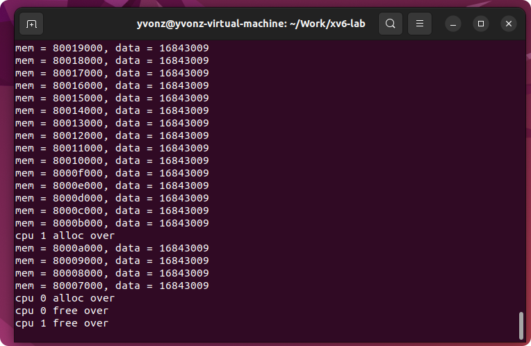
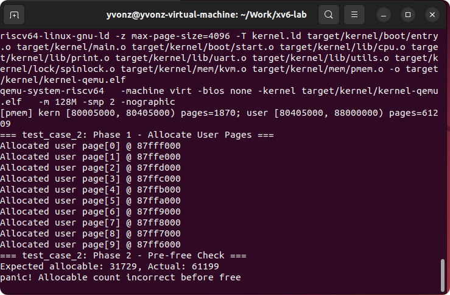
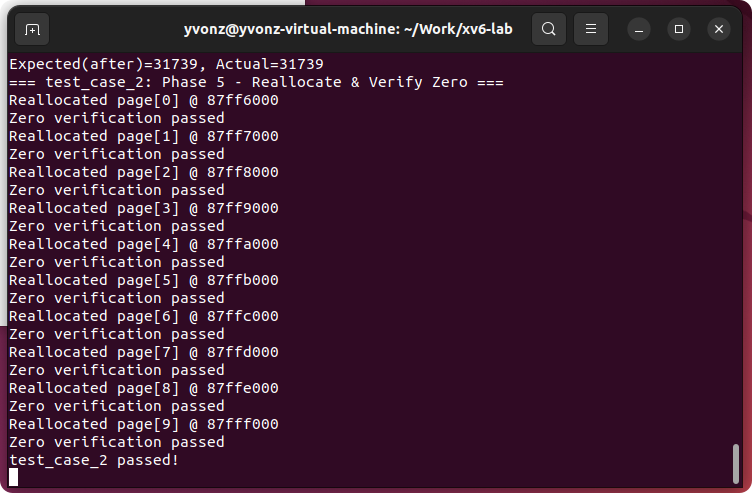
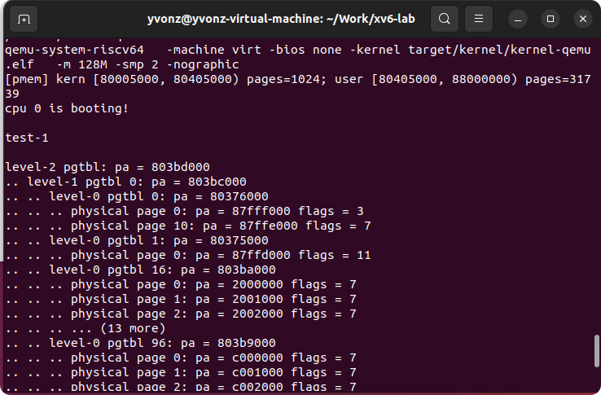
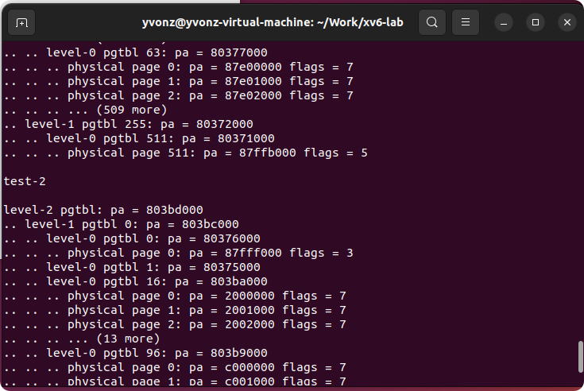
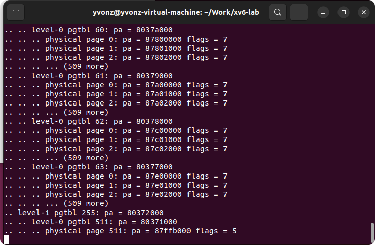
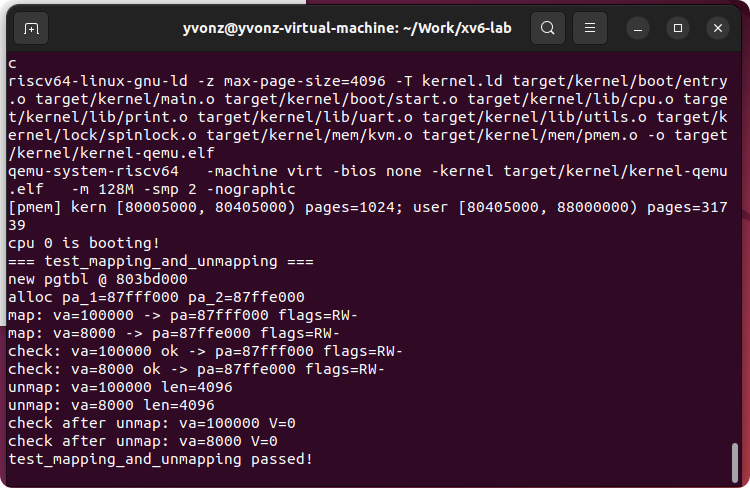

# Lab 2 —— 物理内存管理（pmem）与页表（Sv39）

课程：操作系统实验 · RISC-V · xv6-lite  
学生仓库：xv6-lab（在队友完成的 lab-1 基础上继续）  
运行环境：Ubuntu 虚拟机 + QEMU riscv64 + riscv64 工具链

---

## 0. 成员与分工

- **A（周屹枫）**：lab-2 代码实现与联调、测试用例编写、README 撰写与截图整理  
- **B（严之皓）**：承接 lab-1（串口/自旋锁/启动），协助接口对齐与代码走查


---

## 1. 本实验目标 & 与 lab-1 相比的新增功能

### 1.1 新增能力
- **pmem**：物理页分配器（内核区/用户区、alloc/free、页对齐、归零验证）  
- **kvm**：Sv39 三层页表（vm_getpte/vm_mappages/vm_unmappages，kvm_init/inithart）

### 1.2 与 lab-1 的承接关系（逻辑流）
```
boot/entry.S -> boot/start.c -> lib/print, lock/spinlock（来自 lab-1）
                                     |
                                     v
                                  pmem_init()
                                     |
                                     v
                                  kvm_init() + kvm_inithart()
                                     |
                                     v
                              运行 main.c 中的测试用例
```

---

## 2. 目录结构（与 lab-1 的差异点）
```
src/kernel/
  boot/            # 启动
  lib/             # 基础库（print/uart/utils/cpu）
  lock/            # 自旋锁（lab-1）
  mem/             # ★lab-2 新增/变更
    pmem.c         # 物理页分配器
    kvm.c          # Sv39 页表
    type.h         # 常量/类型/宏
    method.h       # 接口声明
    mod.h          # 聚合头
  main.c           # ★测试用例
pictures/          # ★测试截图目录
```

---

## 3. 如何编译与运行

```bash
make clean && make -j
make run CPUS=1
# 退出 QEMU：Ctrl-A 然后按 X
```

**main.c 测试开关**：
```c
#define RUN_PMEM_TEST_OOM        0
#define RUN_PMEM_TEST_USER       1
#define RUN_VM_TEST_DEMO_PRINT   0
#define RUN_VM_TEST_MAP_UNMAP    1
```


---

## 4. 过程性日志（每个 test 做了什么）

### 阶段一 · Test1：测试用例
- **目的**：cpu-0和cpu-1并行申请内核空间的全部物理内存, 赋值并输出信息；待申请全部结束, 并行释放所有申请的物理内存
- **输出截图如下：**



### 阶段一 · Test2：内存耗尽（预期 panic）+用户区常规分配/释放/归零
- **目的**：
  1) 申请 N=10 个用户页  
  2) allocable 计数变化正确  
  3) 释放后再次分配应为 0 填充
- **输出截图如下：**




### 阶段二 · Test1：页表映射打印（演示）
- **目的**：对指定 VA 段建立映射并打印 3 级结构以及我多加的一些页
- **输出截图如下：**






### 阶段二 · Test2：映射 + 解除映射 + 校验
- **目的**：验证 vm_mappages() 与 vm_unmappages() 的正确性
- **输出截图如下：**


---

## 5. 试错与坑点记录

### 5.1 构建期问题
- `entry.d: No such file or directory` → 修复：构建前 mkdir -p  
- 宏未声明（PGROUNDUP/PGROUNDDOWN/initlock） → 修复：type.h 与 mod.h 补声明  
- `assert` 参数类型错误 → cond 必须为 bool  
- `MAKE_SATP` 函数/宏冲突 → 删除 kvm.c 中的函数，仅保留宏  
- `undefined reference to KERNEL_START/END` → 改为 `[KERNEL_BASE, ALLOC_BEGIN)` 区间

### 5.2 Test2：计数不一致
- 现象：Expected(before) 与 Actual 不符  
- 修复：统一以 `(end - begin)/PGSIZE` 为基准，在锁保护下更新计数

### 5.3 Test1：打印爆屏
- 原因：vm_print 打印了所有基础映射  
- 修复：限量打印或仅打印感兴趣的 VA

### 5.4 Test3：权限断言失败
- 原因：第二条映射只 R，断言检查 R|W  
- 修复：把映射改为 R|W

---

## 6. 重要实现点

- **pmem**：region_build 对齐修正 + 链表 + 归零验证  
- **kvm**：中间页表页仅 V，叶子 PTE=PA|perm|V，unmap 校验+可选回收


---

## 7. 思考与总结

- 自旋锁的必要性：保证链表与计数一致性  
- Sv39 三层结构：中间层为页表页，叶子层存物理映射  
- trap 的意义：为权限错误/缺页提供机制  
- 三个测试覆盖异常路径、常规路径与页表正确性


---


## 8. 附：已知限制

- 未实现释放整棵页表的函数  
- 基础映射简化：内核镜像整体 RWX，未使用链接符号

---

**致谢**：感谢队友在 lab-1 的基础与配合，感谢助教提供测试样例与审阅。
