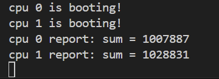
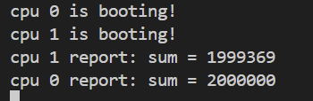
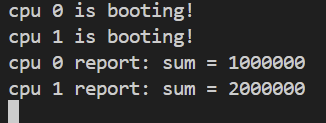
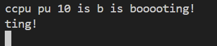

# LAB‑1

这是 ECNU-OSLAB-2025 的第一阶段任务，基于前期的 lab-0 实验继续完成。  
这次主要做了几件事：实现系统的 启动流程、编写 UART 串口驱动、让 `printf` 能正常工作，并在此基础上加入了spinlock来保证多核情况下的资源访问安全。  
最后还做了两个小实验并行加法和并行输出，用来验证锁的作用。

---

## 一、运行方法（Ubuntu）

### 1. 环境准备

安装依赖：

```bash
sudo apt update
sudo apt install -y build-essential make qemu-system-misc gcc-riscv64-linux-gnu
```

### 2. 获取项目

```bash
git clone https://github.com/4bqwq/xv6-lab.git
cd xv6-lab
```

### 3. 编译内核

```bash
make build
```

生成的文件位于：

```
target/kernel/kernel-qemu.elf
```

### 4. 运行实验

```bash
qemu-system-riscv64 -machine virt -bios none \
  -kernel target/kernel/kernel-qemu.elf \
  -m 128M -smp 2 -nographic
```

要退出 QEMU，按：

```
Ctrl + a，然后按 x
```

### 5. 示例输出

运行成功后，终端会出现类似输出：

```
cpu 0 is booting!
cpu 1 is booting!
```

不同实验部分的输出内容可能略有不同，但看到多个 CPU 启动信息即表示系统正常运行。

### 6. 清理构建结果

```bash
make clean
```

---

## 二、完成的模块实现概述

这次实验中，我主要修改和补全了四个文件：`start.c`、`print.c`、`spinlock.c` 和 `main.c`。
大部分框架其实在模板里已经给好了，我做的工作主要是把关键的函数逻辑补上。下面是每个部分的具体说明。

### 1. start.c

`start.c` 主要负责在每个 CPU 从 `_entry` 汇编入口进入后，完成必要的状态设置并切换到 S 模式。
在模板中，大部分初始化逻辑已经有了，比如关闭分页、设置栈指针、保存 `mhartid` 等。
我在这个文件里做的修改比较小，主要是把启动流程的最后两步补完整：

```c
w_mepc((uint64)main);
asm volatile("mret");
```

这两行代码让处理器真正从 M 模式跳到 S 模式，并开始执行 `main()`。
如果没有它们，系统会停在M模式下，无法进入主函数。

我还在结尾加了一个小循环：

```c
for (;;)
    asm volatile("wfi");
```

这样当切换失败或跳转返回时，CPU 会直接进入等待状态，避免继续执行无效指令。

---

### 2. print.c：

这部分我做的事情主要是把 `printf()` 填完整，让它能处理常见的几种格式，然后把每个字符通过 `uart_putc_sync()` 发到串口。模板里已经有 `uart.c`、`printint()`、`printptr()` 这些基础块，所以我的工作更像是把它们拼起来，并把可变参数这一步接上。

大概有这几个改动点：

- 引入了 `<stdarg.h>`，用 `va_list/va_start/va_arg/va_end` 处理不定参数；
- 按字符扫格式串，遇到 `%` 再决定怎么把下一个参数拿出来、怎么打印；
- 对 `NULL` 字符串做了兼容（打印成 `"(null)"`）；
- `assert` 会在条件不满足时直接 `panic`。

在遍历 `fmt` 时，一边遍历一边输出。如果不是 `%`，直接传给 `uart_putc_sync()`；如果遇到 `%`，检查下一个字符以确定格式，然后从 `va_list` 中获取对应的类型，并使用现有的打印函数输出它。

循环大概是这样：

```c
void printf(const char *fmt, ...) {
    va_list ap;
    va_start(ap, fmt);

    for (const char *p = fmt; *p; ++p) {
        if (*p != '%') { 
            uart_putc_sync(*p);
            continue;
        }
        ++p;
        switch (*p) {
            case 'd': {
                int v = va_arg(ap, int);
                printint(v, 10, 1);
                break;
            }
            ...
            default: {
                uart_putc_sync('%');
                uart_putc_sync(*p);
                break;
            }
        }
    }

    va_end(ap);
}
```

我之前也没用过 `va_list`。看起来 `va_list` 本质上是一个指针。`va_start(ap, fmt)` 让它指向第一个可变参数的位置。之后，每次使用 `va_arg(ap, type)` 就可以获取一个指定类型的参数，并将指针向前移动。默认参数提升会起作用，比如传入的 `char` 或 `short` 实际上会变成 `int`，所以使用 `%c` 时，需要以 `int` 类型来获取。

`printf` 的职责是逐个输出“格式化字符序列”。实际写入寄存器的工作在 `uart_putc_sync()` 中完成，该函数会轮询 `LSR_TX_IDLE`，等待发送保持寄存器就绪后，再向 `THR` 的 MMIO 地址写入数据。我未修改这一层，直接复用了它。

这个版本的 `printf` 只能运行和格式化，尚未考虑多核并发输出的问题。因此，当时在 `main.c` 中，我只让 CPU0 打印测试行，以避免因两个核心同时输出而导致串口内容交错。

```c
int cpuid = r_tp();
if (cpuid == 0) {
    printf("cpu %d is booting!\n", cpuid);
    printf("Test: %d %p %x %c %s\n", 998244353, 0x1234, 0x12345678ULL, 'A', "OK");
}
```

---

### 3. spinlock.c

`spinlock.c` 的作用是为多核并发访问提供互斥控制，保证在任意时刻只有一个 CPU 能进入某段临界区。在模板中只有框架，我补全了整个锁的逻辑。

我简单包了一层 GCC 提供的原子内建函数实现交换操作：

```c
static int xchg(volatile int *addr, int newv) {
    return __sync_lock_test_and_set(addr, newv); // 返回旧值，同时写入新值
}

static void xchg_release(volatile int *addr) {
    __sync_lock_release(addr); // 把值原子地清零
}
```

相当于汇编层的 `amoswap.w`。
加锁时反复尝试把 `locked` 从 0 改为 1，如果已经被别的核持有，就自旋等待；释放时再将其置回 0。

`spinlock_acquire()` 先调用 `push_off()` 禁用中断，防止单核上下文切换导致锁状态不一致。然后检查当前 CPU 是否已经持有同一把锁：

```c
assert(!spinlock_holding(lk), msg_acquire(msg_buf, sizeof msg_buf, lk));
while (xchg(&lk->locked, 1) != 0) {}  // 自旋等待锁
__sync_synchronize();
lk->cpuid = mycpuid();
```

释放时则进行相反的检查与清理：

```c
assert(spinlock_holding(lk), msg_release(msg_buf, sizeof msg_buf, lk));
lk->cpuid = -1;
__sync_synchronize();
xchg_release(&lk->locked);
pop_off();
```

这里用了 `__sync_synchronize()` 内存屏障，确保编译器不会乱序优化锁内的操作。

两个函数 `push_off` 和 `pop_off` 已经实现。它们使用一个计数器来维护中断禁用的深度，防止在嵌套场景中过早调用 `pop` 时意外重新启用中断。只有全部解锁后才会真正恢复中断状态，直接用就行了，感恩。

在调试时，我想让assert信息更具体地指出是哪把锁出错，于是额外实现了字符串拼接函数：

```c
static const char* msg_acquire(char* buf, size_t n, spinlock_t* lk) {
    char* p = buf;
    char* end = buf + n;
    p = scpy(p, "acquire: lock '", end);
    p = scpy(p, lk->name, end);
    scpy(p, "' already held", end);
    return buf;
}
```

`assert()` 出错时就能打印：

```
acquire: lock 'printf' already held
```

这部分调试了一段时间。

最初 `msg_acquire()` / `msg_release()` 把字符串写入一个全局数组 `msg_bufs[NCPU][100]` 并返回其指针：

```c
static const char* msg_acquire(spinlock_t* lk) {
    char* p = msg_bufs[mycpuid()];
    p = concat(p, "acquire: lock '");
    p = concat(p, lk->name);
    p = concat(p, "' already held");
    return msg_bufs[mycpuid()];
}
```

当一次 `panic()` 里调用 `printf()`、触发第二次 `panic` 时，新的 `msg_acquire()` 会覆盖同一块全局缓冲区，导致原来的 `s` 指针内容被改写。
所以同一个 `s` 打印出的信息会前后不一致，看起来像锁错。

我改为在每次断言时使用局部缓冲区：

```c
char msg_buf[100];
msg_buf[0] = 0;
assert(!spinlock_holding(lk), msg_acquire(msg_buf, sizeof msg_buf, lk));
```

这样一来，每个 `panic` 都使用独立的栈内存，不会被覆盖，问题也就彻底解决了。

完成锁之后，我在 `printf()` 的开头和结尾各加了一行：

```c
spinlock_acquire(&print_lk);
...
spinlock_release(&print_lk);
```

这样每次输出都是完整的一条消息，不会出现两个 CPU 同时往串口写、字符交错的情况。

---

### 4. main.c

这部分我没做太复杂。

CPU0 先执行 `print_init()` 确认串口就绪，接着自行完成一次 `printf` 输出，随后将 `started = 1` 置为有效，以允许其他核开始打印；其余 CPU 则自旋等待，直到检测到 `started == 1` 后才进行输出。

```c
#include "arch/mod.h"
#include "lib/mod.h"

volatile static int started = 0;

void main(void) {
    int cpuid = mycpuid();
    if (cpuid == 0) {
        print_init();
        printf("cpu %d is booting!\n", cpuid);
        __sync_synchronize();   // 确保前面的初始化操作完成
        started = 1;
    } else {
        while (started == 0) {} // 等 CPU0 放行
        printf("cpu %d is booting!\n", cpuid);
        __sync_synchronize();
    }

    for (;;)
        asm volatile("wfi");
}
```

---

## 三、并行实验

### 2.1 并行加法

在本实验中，两个 CPU 同时执行一百万次 sum++ 操作，以模拟共享变量在多核环境下的竞争情况。通过观察最终结果，可以直观地看到当缺乏同步机制时所产生的数据竞争问题。

#### （1）无锁版本

最初的代码如下：

```c
#include "arch/mod.h"
#include "lib/mod.h"
volatile static int started = 0;
volatile static int sum = 0;

int main()
{
    int cpuid = r_tp();
    if (cpuid == 0) {
        print_init();
        printf("cpu %d is booting!\n", cpuid);
        __sync_synchronize();
        started = 1;
        for (int i = 0; i < 1000000; i++)
            sum++;
        printf("cpu %d report: sum = %d\n", cpuid, sum);
    } else {
        while (started == 0);
        __sync_synchronize();
        printf("cpu %d is booting!\n", cpuid);
        for (int i = 0; i < 1000000; i++)
            sum++;
        printf("cpu %d report: sum = %d\n", cpuid, sum);
    }
    while (1);
}
```

运行输出：



可以看到，最终结果远小于预期的 2000000。
问题在于：`sum++` 不是原子操作，它实际上会被编译成三步：

```
load sum -> add 1 -> store sum
```

当两个 CPU 同时执行这三步时，其中一个 CPU 的写回会覆盖掉另一个的结果，造成丢失更新。

#### （2）细粒度加锁

修正版中，在每次 `sum++` 操作前后加入自旋锁，每次自增都上锁：

```c
for (int i = 0; i < 1000000; i++) {
    spinlock_acquire(&sum_lk);
    sum++;
    spinlock_release(&sum_lk);
}
```

输出结果：



这时结果正确，说明锁成功消除了竞争。

但代价是性能损耗。  
sum 变量所在的缓存行在两个 CPU 之间频繁来回传递（cache ping-pong），每次更新都要触发一致性维护。这种频繁的锁竞争和缓存抖动，让 CPU 看似都在工作，实际上大部分时间都在等彼此。

#### （3）粗粒度加锁

减少锁操作次数，尝试在整个循环外部包一层锁：

```c
spinlock_acquire(&sum_lk);
for (int i = 0; i < 1000000; i++)
    sum++;
printf("cpu %d report: sum = %d\n", cpuid, sum);
spinlock_release(&sum_lk);
```

输出：



此时程序依然正确，且锁开销仅为两次，只在整个加法过程前后各上一次锁，虽然最终也只能一个 CPU 真正执行，但因为极大减少了锁操作次数和缓存往返。

#### （4）每个cpu独立计算总和再合并。

```c
int local = 0;
for (int i = 0; i < 1000000; i++) local++;

// 合并
spinlock_acquire(&sum_lk);
sum += local;
spinlock_release(&sum_lk);
```

这样每个 CPU 仅在合并时锁一次，大大减少了锁竞争。

---


### 2.2 并行输出

第二个实验用来验证多核同时调用 `printf()` 时的输出竞争问题。
串口设备 UART 同一时间只能被一个 CPU 占用。如果不加锁，不同 CPU 的输出字符可能交错，形成混乱的结果。

我去掉了 `print.c` 中 `printf()` 的自旋锁，同时将 started=1 的赋值语句移到 CPU1 的 `printf()` 之前，从而允许两个 CPU 同时进行打印：

```c
#include "arch/mod.h"
#include "lib/mod.h"
volatile static int started = 0;

void main(void) {
    int cpuid = mycpuid();
    if (cpuid == 0) {
        print_init();
        __sync_synchronize();
        started = 1;
        printf("cpu %d is booting!\n", cpuid);
    } else {
        while (started == 0) {}
        printf("cpu %d is booting!\n", cpuid);
        __sync_synchronize();
    }

    for (;;)
        asm volatile("wfi");
}
```

输出结果如下：



可以看到，多核同时打印时，字符被打乱。原因是两条执行流交错执行了多次 `uart_putc_sync()`，每个字符都属于不同的 CPU。

---

## 四、时间记录

本实验历时约 2 天：

* 第一天主要完成启动链路调通、串口驱动封装、printf 功能；
* 第二天集中实现自旋锁、中断栈机制、并设计 4.1/4.2 两个实验场景，同时完成最终的README文档；
