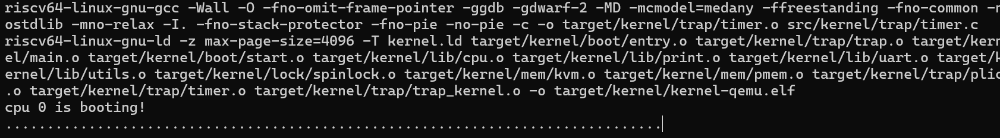
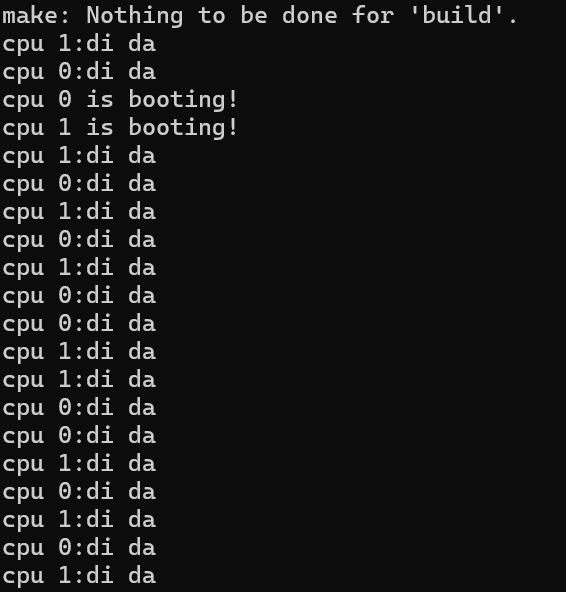
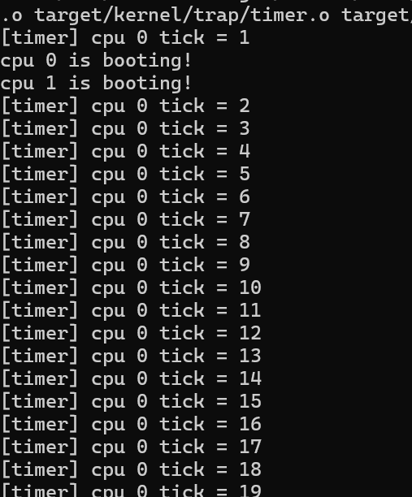
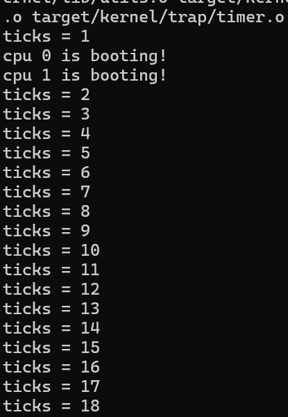
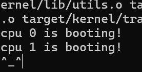
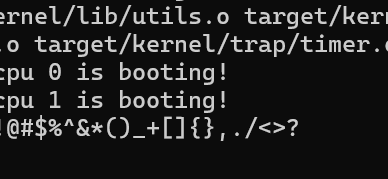
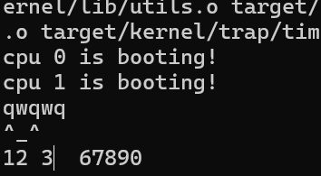

# Lab3：Trap 中断与异常处理报告

- **A（严之皓）**：负责 Lab3 的代码实现，包括中断与异常处理逻辑、定时器与 PLIC 初始化；完成报告撰写。
- **B（周屹枫）**：承接 Lab2 的内存与页表管理模块。

## 项目运行与环境

在项目根目录下执行以下命令即可编译并运行内核：

```bash
make build && make run
```

## 一：M-mode Trap 初始化

为了让内核能在 S-mode 处理中断和异常，我首先需要修改位于 `src/kernel/boot/start.c` 的 M-mode 启动流程。核心任务是将 Trap 的处理权从 M-mode “委派”给 S-mode。

默认情况下，所有 Trap 都会被 M-mode 捕获。我的目标是让内核（运行在 S-mode）接管绝大多数中断和异常。具体方案是修改 `start()` 函数，在进入 `main` 之前，配置 `medeleg` 和 `mideleg` 寄存器，将几乎所有的中断和异常都委托给 S-mode 处理。同时，我需要通过 `mcounteren` 寄存器开放 S-mode 对硬件计数器的访问权限，并调用 `timer_init()` 启动时钟。

### 实现细节

我在 `start()` 函数中加入了以下代码：

```c
// src/kernel/boot/start.c

void start() {
    // ...
    w_medeleg(~0ULL);
    w_mideleg(~0ULL);
    w_mcounteren(0x7);
    timer_init(); // 初始化 CLINT 定时器
    // ...
}
```

- `w_medeleg(~0ULL)` 和 `w_mideleg(~0ULL)`：这两行代码使用 `~0ULL`（全 1）的掩码，意为“将所有能委派的异常（medeleg）和中断（mideleg）都委派给 S-mode”。这是一种简单直接的配置方式。我了解到，这种方式虽然便捷，但也存在一定风险，比如它同样会委派来自 S-mode 的 `ecall`（异常号 9），这可能导致未来依赖 SBI 的功能失效。但在当前实验场景下，这种配置是可行的。
- `w_mcounteren(0x7)`：将 `mcounteren` 的低三位（CY, TM, IR）置 1，允许 S-mode 直接读取 `cycle`, `time`, `instret` 这三个硬件计数器，避免了因权限不足而引发的非法指令异常。
- `timer_init()`：该函数负责初始化 M-mode 下的时钟。它会设置第一次时钟中断的触发时间、配置 M-mode 的 Trap 入口（`mtvec` 指向 `timer_vector`），并使能 M-mode 的时钟中断。此举是后续所有 S-mode 时钟处理的起点。

## 二：S-mode 时钟中断

RISC-V 架构中，`mtime` 和 `mtimecmp` 寄存器只能在 M-mode 下访问，而操作系统运行在 S-mode，因此 S-mode 无法直接控制时钟中断。这个模块的目标就是完成 M-mode 的定时器先触发中断，然后通过软件中断把信号转给 S-mode，最后由内核处理的这个全流程，这样操作系统就能拿到时钟滴答来做计时和任务调度。

在上一模块中，M-mode 已通过 `timer_init()` 设置好定时器：

- 每当 `mtime` 达到 `mtimecmp` 时，M-mode 收到一次 **Machine Timer Interrupt (MTI)**；
- `timer_vector`（位于汇编 trap 入口）会更新下一次触发时间，并设置 **S-mode 软件中断挂起位（SSIP）**；
- 随后，S-mode 收到 **Software Interrupt (SSIP)**，在内核 Trap 入口中进入 `trap_kernel_handler()`；
- 最终由 `timer_interrupt_handler()` 更新全局时钟 `ticks`。

本部分主要任务就是在 S-mode 正确打开这些中断开关、接入初始化流程，并验证中断路径是否完全打通。

### 实现细节

#### 1.  `main.c`  Trap 初始化

在系统初始化函数 `main()` 中，增加以下两行调用，使 Trap 子系统在内核启动阶段被初始化：

```c
trap_kernel_init();
trap_kernel_inithart();
```

这两步分别对应：

* `trap_kernel_init()`：进行全局 Trap 初始化（包括 PLIC、时钟结构体创建等）；
* `trap_kernel_inithart()`：对当前 CPU 进行局部 Trap 初始化，设置 Trap 入口并打开中断接收。

然后 Trap 系统就可以纳入内核启动流程了。

#### 2.  `trap_kernel_inithart()` 打开 S-mode 中断接收

通过写 `sie` 寄存器，打开 S-mode 对中断的响应能力。相关宏定义在 `trap/type.h` 中新增：

```c
#define SIE_SSIE (1 << 1)  // 软件中断使能
#define SIE_STIE (1 << 5)  // 定时器中断使能（暂未使用）
#define SIE_SEIE (1 << 9)  // 外部中断使能
```

对应的初始化函数如下：

```c
// src/kernel/trap/trap_kernel.c
void trap_kernel_inithart()
{
    // 初始化本核的 PLIC
    plic_inithart();

    // 设置 S 态 Trap 向量表地址
    w_stvec((uint64)kernel_vector);

    // 打开 S 模式软件中断 (SSIP)
    w_sie(r_sie() | SIE_SSIE);

    // 打开 S 模式外部中断 (SEIP)
    w_sie(r_sie() | SIE_SEIE);

    // 打开全局中断 (sstatus.SIE)
    intr_on();
}
```

这样配置后，S-mode 就可以接收：

* 来自 M-mode 转发的软件中断（定时器）；
* 来自外设的外部中断（UART）。

#### 3.  `trap_kernel_handler()` 补全中断分发

模板代码中 `trap_kernel_handler()` 已实现 Trap 分类框架（通过 `scause` 判断中断/异常）。
我在其中补充了两个新的中断分支：

```c
case 1: // S-mode 软件中断
    timer_interrupt_handler();
    break;

case 9: // S-mode 外部中断
    external_interrupt_handler();
    break;
```

* 当 `scause` 表示软件中断时（中断号为 1），调用 `timer_interrupt_handler()` 处理时钟；
* 当中断号为 9 时，进入外部中断分发函数（后续模块用于 UART）。

这一步使 S-mode Trap 能够正确识别和分派时钟与外设中断。

#### 4. 时钟更新

S-mode 的全局时钟定义在 `src/kernel/trap/timer.c`：

```c
typedef struct {
    volatile uint64 ticks;
} timer_t;

static timer_t sys_timer;
```

对应函数如下：

```c
void timer_create() {
    sys_timer.ticks = 0;
}

void timer_update(void) {
    sys_timer.ticks++;
}

uint64 timer_get_ticks() {
    return sys_timer.ticks;
}
```

其中：

* `timer_create()` 在 `trap_kernel_init()` 中被调用，用于初始化；
* `timer_update()` 在每次时钟中断中执行，递增 `ticks`；
* `timer_get_ticks()` 提供安全的只读接口。

#### 5. 验证实验结果

为了验证这一段是否跑起来了，我在 `timer_update()` 函数中加入了一行调试输出：

```c
void timer_update(void) {
    sys_timer.ticks++;
    printf("."); // 每次中断打印一个点
}
```

运行内核后，终端中会周期性打印“......”，如下图所示：



说明时钟中断链路确实能跑起来了。

从 M-mode 到 S-mode 的完整触发流程大概长这样的：

```
M-mode: timer_init() 设置定时器 -> 到期触发 MTI -> 进入 timer_vector
        timer_vector: 更新 mtimecmp，设置 SSIP
S-mode: 收到 SSIP -> 进入 trap_kernel_handler()
        调用 timer_interrupt_handler()
        timer_update(): ticks++
```

## 三：S-mode 外设（UART）中断

为了实现交互式输入，这个 Lab 需要通过 PLIC (Platform-Level Interrupt Controller) 实现 UART 串口中断。

当用户通过键盘输入时，UART 设备会产生一个中断信号。我需要让内核能捕获这个信号，读取输入的字符，并将其回显到屏幕上。大概的流程如下：
1.  通过 PLIC 将来自 UART 的外部中断路由到 S-mode。
2.  在 S-mode 的 `external_interrupt_handler` 中，通过 `plic_claim` 获取中断号（IRQ），判断是否为 `UART_IRQ`。
3.  若是，则调用 `uart_intr()` 处理函数。
4.  处理完毕后，通过 `plic_complete` 通知 PLIC。
5.  对 `uart_intr()` 进行增强，以支持回车换行和退格删除功能。

### 实现细节

#### 1.  外部中断处理

 `external_interrupt_handler`这个函数首先认领中断，然后根据中断号进行相应处理，最后完成中断。

 ```c
 // src/kernel/trap/trap_kernel.c
 void external_interrupt_handler()
 {
    int irq = plic_claim();     // 取中断号

    if (irq == UART_IRQ) {
        // 串口中断，调用UART
        uart_intr();
    } else if (irq != 0) {
        // 其它外设，目前应该是还没用，暂时做个提示
        printf("[trap] unexpected PLIC irq=%d\n", irq);
    }

    if (irq != 0) {
        // 通知 PLIC 继续发下一个
        plic_complete(irq);
    }
}
 ```
在这里，`plic_claim()` 会返回当前待处理的中断号（例如 10 表示 UART），然后进入相应的中断服务函数。
中断处理完成后调用 `plic_complete(irq)`，否则该中断会一直处于挂起状态，后续无法再触发。
这样能够保证了 PLIC 在多核情况下不会重复分发同一个中断，从而避免并发冲突。

#### 2.  输入回显

对 `src/kernel/lib/uart.c` 中的 `uart_intr` 函数进行了重写。

```c
// src/kernel/lib/uart.c
void uart_intr(void)
{
    while (1) {
        int c = uart_getc_sync();
        if (c == -1) break;

        if (c == '\r') {
            // CR 回显 CRLF
            uart_putc_sync('\r');
            uart_putc_sync('\n');
        } else if (c == '\b' || c == 0x7f) {
            // Backspace/DEL 回显退格删除
            uart_putc_sync('\b');
            uart_putc_sync(' ');
            uart_putc_sync('\b');
        } else {
            // 普通字符原样回显
            uart_putc_sync(c);
        }
    }
}
```

当检测到回车符 `\r` 时，系统回显 `\r\n`，实现正确的换行效果；  
当检测到退格符 `\b` 或删除符 `0x7f` 时，系统回显 `\b \b`，即光标左移、覆盖空格、再左移，实现视觉上的删除。  
其余普通字符则直接原样回显。

## 四：测试与验证

### 1. 多核中断接收验证

为了确认时钟中断能够正确广播到所有 CPU 核心，我在 `timer_interrupt_handler()` 中临时加入调试语句：

```c
printf("cpu %d: di da\n", mycpuid());
```

运行结果如下：



从图中可以看到，`cpu 0` 与 `cpu 1` 都能周期性地打印出 “di da”。
这表明 CLINT 产生的时钟中断被正确地广播给了系统中所有的 CPU 核心，S-mode 的中断接收机制在多核环境下能够稳定工作。


### 2. 单核更新 `ticks` 验证

在多核系统中，时钟中断虽然广播到所有 CPU，但为了避免对全局变量 `sys_timer.ticks` 的竞争访问，只允许 `cpu 0` 执行更新。
我在 `timer_update()` 函数中加入如下调试输出：

```c
printf("[timer] cpu %d tick = %d\n", mycpuid(), timer_get_ticks());
```

测试结果如下图所示：



从输出可以看到，所有的 `tick` 输出均来自 `cpu 0`，而 `cpu 1` 并未参与更新操作。
这验证了 `if (mycpuid() == 0)` 条件分支的设计逻辑，确保了多核环境下的全局时钟计数仅由单核维护，从而成功避免了并发写入带来的竞态问题。

### 3. 时钟速率调节验证

为了验证时钟周期的可调性，我修改了 `src/kernel/trap/type.h` 中的 `INTERVAL` 宏：

```c
#define INTERVAL 100000UL
```

调整该值后重新编译运行系统（需执行 `make clean && make run`），即可观察到 `ticks` 打印速度随 `INTERVAL` 改变而加快或减慢。
下图展示了 `ticks` 的输出效果：



从结果可以直观看出，系统时钟的节拍频率与 `INTERVAL` 参数直接相关。

不过修改 `INTERVAL` 参数后，确实需要先执行 `clean build` 才能刷新；如果直接 build，不知为何会提示没有内容需要构建，导致 ELF 文件不会更新，有点奇怪。

### 4. UART 中断与输入回显测试

#### （1）基本输入与特殊字符

我在 QEMU 控制台中直接输入普通字符与特殊字符，系统能即时正确回显输入内容。
回显包括普通字母、数字、符号等，以及 CR（回车）和 DEL（删除）等特殊字符。
实验结果如下：




从输出可以看到，系统在接收输入后立即触发外部中断，并调用 `uart_intr()` 进行回显，整个中断链路从硬件到软件端均工作正常。

#### （2）退格与光标行为测试

为了进一步验证回显逻辑的正确性，我在 QEMU 控制台中对退格键和方向键等特殊控制序列的行为进行了测试。
测试过程和现象如下：



我发现当前实现的 UART 回显功能是支持使用方向键移动光标和退格删除字符的。具体表现如下：

* 在行尾使用 **Backspace** 时，最后一个字符会被正确删除，光标同时左移，行为正常；
* 当光标移动到中间位置再按 **Backspace** 时，当前字符会被空格覆盖，但后续字符不会自动前移；
* 这种效果类似文本编辑器的“覆盖模式（Insert/Overwrite）”，也就是说删除的只是当前位置内容，而不是重新排列整行；
* 此外，使用左右方向键可以正常移动光标，但当前实现并不会自动重绘后续字符，只是单纯移动光标位置。用起来还挺有意思的。

这种行为符合我在 `uart_intr()` 中的设计逻辑：
退格仅负责在当前光标位置执行局部擦除，不涉及整行缓冲或复杂重绘。

**致谢**：感谢队友在 lab-2 的基础与配合，感谢助教提供测试样例与审阅。
